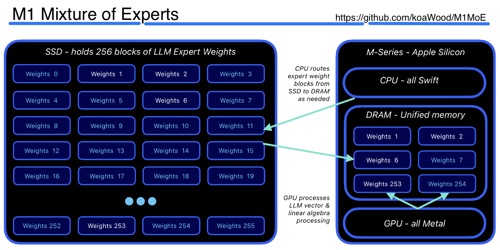

# M1MoE

A Mixture-of-Experts LLM inference engine for Apple Silicon. Runs [OLMoE-1B-7B](https://huggingface.co/allenai/OLMoE-1B-7B-0924-Instruct) and [Mixtral-8x7B](https://huggingface.co/mistralai/Mixtral-8x7B-Instruct-v0.1) locally on any M-series Mac with streaming token generation.  

                                                            

```
You: what is a mixture of experts model?
Bot: A Mixture of Experts (MoE) model is a neural network architecture where
     each input token is routed to a small subset of specialized sub-networks
     (experts) rather than passing through every parameter on every forward pass...
  [38 ms/tok · 26.3 tok/s · ctx 142]
```

Based on Apple's [LLM in a Flash](https://arxiv.org/pdf/2312.11514) research paper, which describes techniques for running large language models efficiently on devices with limited DRAM by streaming weights from flash storage on demand.

Imagine running a 7 billion parameter LLM locally on a M1 MacBook Air!  (OK, it works, but it's SLOOOOOW!)  

Faster M-series chips perform significantly better.

## Performance (M1 Macbook Air w/ 16GB RAM)

**OLMoE:** OLMoE is a good choice for quick model verification on base M1. All experts fit in the 16 GB window, so generation is steady at roughly **6 tok/s** in release mode. However, the model is basically unusable, as simple prompts like "The capital of France is?" results in a looping output of "The".  LoL.  Quality degrades noticeably at higher temperatures on short or ambiguous prompts; lower temperatures (0.3–0.5) give more coherent output, but don't expect miracles.

**Mixtral:** Mixtral is runnable on M1/16 GB but it is not really practical for interactive use. Only 78 of the 256 expert weight blocks fit in DRAM simultaneously; every cache miss requires loading a 94 MB chunk from SSD, which dominates latency. At **~0.39 tok/s** (roughly one token every 2.5 seconds), it is better suited for batch or offline use. A Mac with **32 GB or more** of unified memory is the realistic minimum for a tolerable Mixtral experience.  Notwithstanding it's interminably slow response, the model itself is quite capable.  Not only did it recognize the Capital of France, but it can go on to explain what's amazing about the city and if you'd like, an interesting monologue on it's history as well.  But, it takes just over 1 minute to begin it's response, and it's about 3 mintues per paragrah on my M1 16GB RAM Macbook Air.  Type your prompt and grab a cup of coffee.

## How It Works

MoE models are large but sparse — only a handful of expert sub-networks activate per token. M1MoE exploits this: only the top-K expert weight blocks needed for each token are loaded from SSD into DRAM, then handed to the Metal GPU. Dense operations (attention, projections) stay on GPU throughout; sparse routing decisions run on CPU. An LRU cache keeps recently-used experts in DRAM to amortise repeated loads.

- **Zero-copy weight access** — non-expert weights are `mmap`'d and wrapped as a `MTLBuffer` with no extra copy
- **4-bit group quantization** — expert weights are stored as 4-bit packed nibbles with per-group-of-64 BF16 scales and biases
- **Hardware-adaptive** — detects M1/M2/M3/M4 GPU tier and available RAM at startup; sizes the expert DRAM cache accordingly (≈60% of available RAM)
- **Fully config-driven** — all architecture parameters come from a JSON file; no constants in Swift or Metal

## Requirements

- macOS 14 (Sonoma) or later
- Apple Silicon (M1 or newer)
- Swift 5.9+ (`xcode-select --install` or Xcode 15+)
- Python 3.9+ and `numpy` (for weight extraction only)

## Quick Start

**1. Build**

```bash
git clone <this repo>
cd M1MoE
swift build -c release
```

**2. Download and convert OLMoE** (≈2.5 GB download, ≈8 min conversion)

```bash
pip install huggingface_hub numpy
huggingface-cli download allenai/OLMoE-1B-7B-0924-Instruct \
  --local-dir ~/models/OLMoE-1B-7B-0924-Instruct \
  --include "*.safetensors" "tokenizer.json"

python scripts/extract_olmoe.py \
  --model-dir ~/models/OLMoE-1B-7B-0924-Instruct \
  --out-dir   ~/models/olmoe-m1moe

cp ~/models/OLMoE-1B-7B-0924-Instruct/tokenizer.json \
   ~/models/olmoe-m1moe/tokenizer.json
```

**3. Update the config** — edit `configs/olmoe-1b-7b.json` and set `model_dir` to `~/models/olmoe-m1moe`.

**4. Chat**

```bash
swift run -c release chat --config configs/olmoe-1b-7b.json
```

## Executables

### `chat` — Interactive REPL

```
chat --config PATH [--model PATH] [--system TEXT]
     [--temp T] [--top-p P] [--max-ctx N]
```

| Option | Default | Description |
|---|---|---|
| `--config` | _(required)_ | Path to model JSON config |
| `--model` | from config | Override `model_dir` |
| `--system` | none | System prompt text |
| `--temp` | `0.7` | Sampling temperature (0 = greedy) |
| `--top-p` | `0.9` | Nucleus sampling threshold |
| `--max-ctx` | `2048` | Token budget before sliding-window truncation |

Commands during chat:

| Command | Effect |
|---|---|
| `/reset` | Clear KV cache and conversation history |
| `/system TEXT` | Replace system prompt and reset |
| `/stats` | Show ms/tok and tok/s for the last turn |
| `/quit` | Exit |

A persistent system prompt can be placed in `~/.m1moe/system.md` and will be loaded automatically if `--system` is not given.

### `bench` — Throughput Benchmark

```
bench --config PATH [--model PATH] [--prompt TEXT] [--tokens N] [--temp T]
```

Runs a prefill pass then generates N tokens, reporting ms/tok and tok/s.

```
[config] OLMoE-1B-7B-0924 (olmoe)
[config] 16 layers, 64 experts, top-8
[hw] Apple M2 Max, 96 GB RAM
[bench] prefill: 312 ms (19.5 ms/tok)
[bench] 20 tokens: 36.1 ms/tok (27.7 tok/s) [min 33 max 41 ms]
```

## Configs

Two configs are included:

| File | Model | RAM needed |
|---|---|---|
| `configs/olmoe-1b-7b.json` | OLMoE-1B-7B-0924-Instruct | 8 GB+ |
| `configs/mixtral-8x7b.json` | Mixtral-8x7B-Instruct-v0.1 | 32 GB+ |

Set `model_dir` in each config to the path where you ran the extraction script.

## Adding More Models

See **[EXTEND.md](docs/EXTEND.md)** for:
- Step-by-step download and extraction instructions for each supported model
- How to write an extraction script and JSON config for other HuggingFace MoE models
- Disk space, RAM, and conversion time reference

## Architecture

See **[ARCH.md](docs/ARCH.md)** for a detailed description of the engine internals including data flow diagrams, the per-token forward pass, Metal kernel descriptions, memory layout, and quantization format.

## Project Structure

```
Sources/
  M1MoE/           Core library
    ModelSpec.swift       JSON config loader and all architecture structs
    HardwareProfile.swift Apple Silicon tier detection and buffer sizing
    MetalContext.swift    GPU device, pipeline compilation, scratch buffers
    WeightStore.swift     mmap-backed non-expert weight access
    ExpertCache.swift     LRU DRAM cache for on-demand expert loading
    InferenceEngine.swift Token-by-token transformer forward pass
    Tokenizer.swift       BPE tokenizer (byte-level and SentencePiece)
    Shaders.metal         11 Metal compute kernels
  chat/main.swift    Interactive REPL
  bench/main.swift   Benchmark tool
configs/
  olmoe-1b-7b.json
  mixtral-8x7b.json
scripts/
  extract_olmoe.py   Convert OLMoE safetensors → M1MoE format
  extract_mixtral.py Convert Mixtral safetensors → M1MoE format
```

## License

MIT
