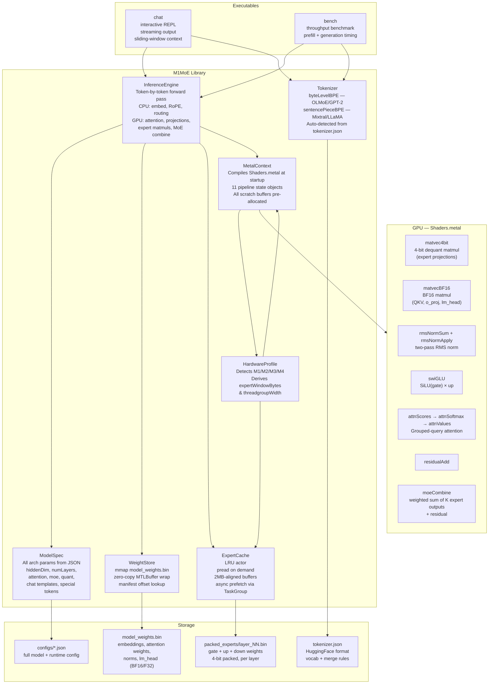
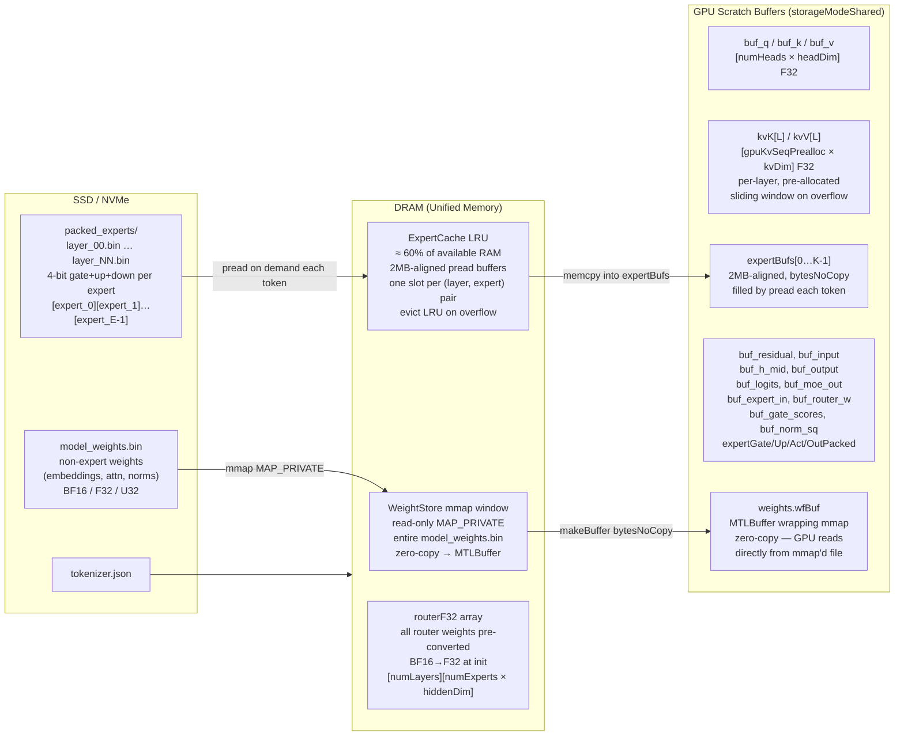
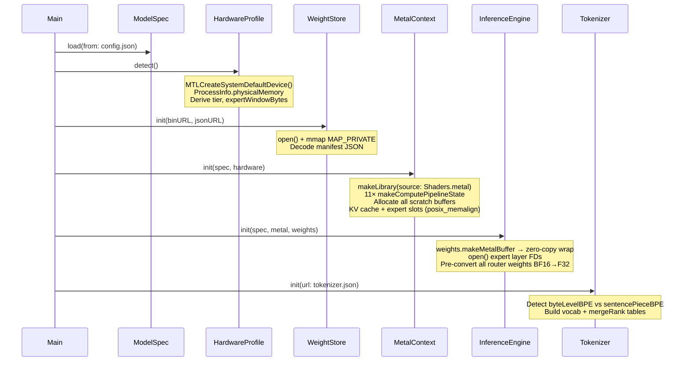

# M1MoE — Architecture Reference

## What It Is

M1MoE is a from-scratch Mixture-of-Experts (MoE) LLM inference engine written in Swift for Apple Silicon Macs. It runs large sparse models — specifically **OLMoE-1B-7B** and **Mixtral-8x7B-Instruct** — token-by-token on the local machine, using the Metal GPU for dense matrix operations and the CPU for sparse routing decisions.

The core challenge MoE inference poses on consumer hardware is that the full expert weight set is far too large to fit in GPU memory (or even system RAM for the largest models). M1MoE addresses this with a **dynamic expert loading** strategy: at each layer, only the top-K experts needed for the current token are loaded from SSD into 2MB-aligned DRAM buffers, then handed to the GPU for computation. An LRU cache keeps recently-used expert weights in DRAM to amortise repeated loads.

The engine is fully parameterised from JSON config files — no architecture constants are hardcoded in Swift or Metal. Both supported architectures (OLMoE and Mixtral) run through the same forward-pass code path.

---

## Repository Layout

```
M1MoE/
├── Package.swift                    Swift Package Manager manifest
├── configs/
│   ├── olmoe-1b-7b.json             OLMoE-1B-7B model config
│   └── mixtral-8x7b.json            Mixtral-8x7B-Instruct config
├── Sources/
│   ├── M1MoE/                       Core library (linked by both executables)
│   │   ├── ModelSpec.swift          JSON-driven model configuration
│   │   ├── HardwareProfile.swift    Apple Silicon tier detection & buffer sizing
│   │   ├── MetalContext.swift       GPU device, pipeline compilation, scratch buffers
│   │   ├── WeightStore.swift        mmap-backed non-expert weight store
│   │   ├── ExpertCache.swift        LRU DRAM cache for on-demand expert loading
│   │   ├── InferenceEngine.swift    Token-by-token transformer forward pass
│   │   ├── Tokenizer.swift          BPE tokenizer (byte-level + SentencePiece modes)
│   │   └── Shaders.metal            11 Metal compute kernels
│   ├── chat/
│   │   └── main.swift               Interactive multi-turn REPL
│   └── bench/
│       └── main.swift               Single-prompt throughput benchmark
└── scripts/
    ├── extract_olmoe.py             Weight extraction for OLMoE
    └── extract_mixtral.py           Weight extraction for Mixtral
```

---

## Component Architecture



---

## Per-Token Forward Pass

Each call to `InferenceEngine.forward(token:temperature:topP:)` runs the full transformer and returns the next predicted token. The pass is **synchronous** — it blocks on both GPU completion and SSD I/O — and must be called from a background thread.

```mermaid
flowchart TD
    IN["Input token ID (UInt32)"]
    IN --> EMB

    EMB["1 · Embed\nCPU: BF16 embedding row → F32 vector\nbuf_input ← embedding[token × hiddenDim]\nbuf_residual ← buf_input"]

    EMB --> LOOP

    subgraph LOOP["For each transformer layer L  (0 … numLayers−1)"]
        direction TB

        CMD1["CMD1 — GPU\n① RMS norm input → buf_input\n② Q projection  (BF16 matmul)\n③ K projection  (BF16 matmul)\n④ V projection  (BF16 matmul)"]

        CPU1["CPU sync point\n⑤ QK head RMS norm  (OLMoE only)\n⑥ RoPE: rotate Q and K by position\n⑦ Write K,V into per-layer KV cache\n   at row seqPos"]

        CMD2["CMD2 — GPU\n⑧  attnScores  Q·Kᵀ scaled dot-product\n⑨  attnSoftmax  per-head in-place\n⑩  attnValues  scores·V\n⑪  o_proj  BF16 matmul\n⑫  residualAdd  buf_residual += o_proj\n⑬  RMS norm post-attention → buf_h_mid"]

        CPU2["CPU sync point\n⑭ Router: dot(buf_h_mid, routerWeights[L])\n    → softmax → scores[numExperts]\n⑮ selectTopK(scores, k=topK)\n⑯ Load top-K expert blocks\n    pread(layer_NN.bin, expertIdx×expertBytes)\n    into expertBufs[0…K-1]\n⑰ Write routing weights → buf_router_w"]

        CMD3["CMD3 — GPU  (for each of K experts)\n⑱  gate_proj  4-bit dequant matmul\n⑲  up_proj    4-bit dequant matmul\n⑳  swiGLU  SiLU(gate) × up\n㉑  down_proj  4-bit dequant matmul\n    output packed at slot×hiddenDim\nThen:\n㉒  moeCombine  Σ weight_k·expert_k + residual\n    → buf_moe_out"]

        RESUPD["buf_residual ← buf_moe_out"]

        CMD1 --> CPU1 --> CMD2 --> CPU2 --> CMD3 --> RESUPD
    end

    RESUPD --> FINAL

    FINAL["2 · Final norm + lm_head\nGPU: RMS norm → BF16 matmul → buf_logits [vocabSize]"]

    FINAL --> SAMPLE

    SAMPLE["3 · Sample\ntemperature=0 → argmax (greedy)\ntemperature>0 → nucleus sampling (top-p)"]

    SAMPLE --> OUT["Next token ID (UInt32)\nseqPos += 1"]
```



**GPU synchronisation:** Each command buffer is committed and then awaited via `DispatchSemaphore`. This serialises CPU and GPU work within a layer, which is necessary because the CPU uses GPU results (Q/K/V for KV cache store; normed hidden state for routing) before the next GPU pass begins.

---

## Memory Layout & Data Flow



**Key zero-copy path:** `model_weights.bin` is `mmap`'d with `MAP_PRIVATE`, then wrapped as a `MTLBuffer` with `bytesNoCopy`. The GPU kernel reads BF16 weights directly from the OS page cache — no extra copy into a separate Metal buffer. Only the expert weights, which are loaded dynamically per token, go through an explicit `pread` + 2MB-aligned allocation path.

---

## Expert Weight Quantisation

Each expert's weights are stored in a packed 4-bit format on disk. The layout within one expert block is:

```
[gate_proj weights  u32]  [gate scales bf16]  [gate biases bf16]
[up_proj   weights  u32]  [up   scales bf16]  [up   biases bf16]
[down_proj weights  u32]  [down scales bf16]  [down biases bf16]
```

**Dequantisation** happens inside the `matvec4bit` Metal kernel:

```
for each group of 8 packed nibbles:
    val_i = nibble_i × scale + bias      (affine, per group of groupSize=64 elements)
    dot  += val_i × input_i
```

This is computed entirely in the GPU threadgroup, with one threadgroup per output row. The `fma` accumulation from flash-moe is used:

```metal
acc = fma(nibble, scale * x, fma(bias, x, acc));
```

Non-expert weights (QKV projections, o_proj, norms, lm_head) are stored as BF16 in `model_weights.bin` and use the `matvecBF16` kernel, which dequants inline with the BF16-to-F32 bit-cast trick:

```c
inline float bf16_to_f32(ushort b) { uint u = uint(b) << 16; return as_type<float>(u); }
```

---

## Hardware-Adaptive Sizing

`HardwareProfile.detect()` reads the Metal device name and `ProcessInfo.physicalMemory` at startup, then derives all runtime limits:

| GPU tier | Chips | threadgroupWidth |
|---|---|---|
| `.apple3` | M1, M2 | 32 |
| `.apple6` | M2 Pro/Max, M3 | 64 |
| `.apple9` | M3 Max, M4 family | 64 |

**Expert window budget:**

```
expertWindowBytes = (totalRAM − 4GB) × 60%
maxCachedExperts  = expertWindowBytes / expertBytes4Bit
                    capped at numLayers × numExperts
```

The 4 GB headroom is reserved for the OS, KV cache, and non-expert weights. The 60% cap prevents thrashing the kernel page cache that backs the mmap'd weight file.

**KV cache pre-allocation** (Metal buffers, shared mode):

```
per layer: kvK[L] = gpuKvSeqPrealloc × kvDim × 4 bytes
           kvV[L] = gpuKvSeqPrealloc × kvDim × 4 bytes
total      = 2 × numLayers × gpuKvSeqPrealloc × kvDim × 4 bytes
```

For OLMoE: `2 × 16 × 4096 × 2048 × 4 ≈ 1 GB`.
For Mixtral: `2 × 32 × 8192 × 1024 × 4 ≈ 2 GB`.

---

## Metal Kernels — Shaders.metal

All 11 kernels are compiled at runtime from the bundled `Shaders.metal` source using `MTLDevice.makeLibrary(source:options:)` with `fastMathEnabled = true`. Parameters are passed via `setBytes` at encode time; no constants are compiled in.

| Kernel | Grid | Purpose |
|---|---|---|
| `matvec4bit` | 1 threadgroup/output row | 4-bit dequant matrix × vector |
| `matvecBF16` | 1 threadgroup/output row | BF16 matrix × F32 vector |
| `rmsNormSum` | 1 threadgroup, 256 threads | Sum-of-squares reduction |
| `rmsNormApply` | 1 thread/dim | Apply RMS norm with BF16 weight |
| `swiGLU` | 1 thread/dim | SiLU(gate) × up |
| `residualAdd` | 1 thread/dim | Element-wise add |
| `ropeInPlace` | 1 thread/(head, pair) | Rotary position embedding in-place |
| `attnScores` | 1 threadgroup/(head, key_pos) | Scaled Q·Kᵀ dot products |
| `attnSoftmax` | 1 threadgroup/head | In-place per-head softmax |
| `attnValues` | 1 thread/(head, dim) | Weighted sum scores·V |
| `moeCombine` | 1 thread/dim | Σ weight_k · expert_k + residual |

The attention kernels implement **grouped-query attention (GQA)**: each Q head maps to a KV head via `kvHead = qHead / hpkv` (heads-per-kv-head), matching Mixtral's GQA (32 Q heads, 8 KV heads, hpkv=4).

---

## Tokenizer

`Tokenizer` supports two BPE modes detected automatically from `tokenizer.json`:

| Mode | Models | Space encoding | Unknown byte encoding |
|---|---|---|---|
| `byteLevelBPE` | OLMoE, GPT-2, GPT-NeoX | `Ġ` (U+0120) prefix | Direct Unicode surrogates |
| `sentencePieceBPE` | Mixtral, Mistral, LLaMA | `▁` (U+2581) prefix | `<0xNN>` byte fallback tokens |

Detection: `model.byte_fallback == true` in the JSON → SentencePiece mode.

Both modes use the same BPE merge algorithm: greedily apply the lowest-rank merge pair until no more merges are possible.

---

## Chat Template System

`ModelSpec.chatTemplate` returns a `ChatSpec` describing how to wrap turns. If not provided in JSON, architecture defaults are used:

**OLMoE default:**
```
<|system|>
{system}
<|user|>
{user}
<|assistant|>
{assistant}<|endoftext|>
```

**Mixtral default:**
```
[INST] {user} [/INST] {assistant}</s>
```

The chat REPL (`chat/main.swift`) uses these templates to construct and prefill full conversation context, implementing a **sliding-window** strategy when context length exceeds `--max-ctx`: the oldest tokens are dropped and the retained context is re-prefilled from scratch via `engine.reset()` + replay.

---

## Executables

### `chat` — Interactive REPL

```
chat --config PATH [--model PATH] [--system TEXT]
     [--temp T] [--top-p P] [--max-ctx N]
```

Runs on a dedicated `DispatchQueue` (`.userInteractive` QoS). Streams tokens to stdout as they are generated. Supports in-session commands:

| Command | Effect |
|---|---|
| `/reset` | Clear KV cache and conversation history |
| `/system TEXT` | Replace system prompt, reset conversation |
| `/stats` | Show ms/tok and tok/s for last turn |
| `/quit` | Exit |

Reads a persistent system prompt from `~/.m1moe/system.md` if present and `--system` is not specified.

### `bench` — Throughput Benchmark

```
bench --config PATH [--model PATH] [--prompt TEXT]
      [--tokens N] [--temp T] [--top-p P]
```

Reports:
- Model config (layers, experts, expert size)
- Hardware (device name, RAM, expert window count)
- Prefill time and ms/tok
- Generation mean/min/max ms/tok and tok/s

---

## Supported Models

| Config | Architecture | Layers | Experts | top-K | Hidden dim | Vocab | Tokenizer |
|---|---|---|---|---|---|---|---|
| `olmoe-1b-7b.json` | `olmoe` | 16 | 64 | 8 | 2048 | 50304 | byte-level BPE |
| `mixtral-8x7b.json` | `mixtral` | 32 | 8 | 2 | 4096 | 32000 | SentencePiece BPE |

**Architecture differences handled in the forward pass:**

| Feature | OLMoE | Mixtral |
|---|---|---|
| QK head normalisation | Yes (`q_norm`, `k_norm` per layer) | No |
| Router weight key | `mlp.gate.weight` | `block_sparse_moe.gate.weight` |
| GQA | No (numHeads == numKvHeads = 16) | Yes (32 Q heads, 8 KV heads) |
| RoPE theta | 10,000 | 1,000,000 |

---

## On-Disk Model Directory Structure

```
/path/to/model/
├── model_weights.bin          mmap'd — embeddings, attention, norms, lm_head
├── model_weights.json         tensor manifest: {name: {offset, shape, dtype}}
├── tokenizer.json             HuggingFace tokenizer format
└── packed_experts/
    ├── layer_00.bin           [expert_0 block][expert_1 block]…[expert_E−1 block]
    ├── layer_01.bin
    └── …                      one file per layer
```

Expert block byte size is derived from `ModelSpec.expertBytes4Bit`:

```
expertBytes = (gate_w + gate_s + gate_b) + (up_w + up_s + up_b) + (down_w + down_s + down_b)

where:
  gate_w = intermediateDim × (hiddenDim / 8) × 4    # packed u32
  gate_s = intermediateDim × (hiddenDim / groupSize) × 2   # bf16 scales
  gate_b = intermediateDim × (hiddenDim / groupSize) × 2   # bf16 biases
  (up has same shape as gate)
  down_w = hiddenDim × (intermediateDim / 8) × 4
  down_s = hiddenDim × (intermediateDim / groupSize) × 2
  down_b = hiddenDim × (intermediateDim / groupSize) × 2
```

---

## Initialization Sequence



---

## Design Principles

**Zero constants in code.** Every dimension, threshold, and loop bound is read from `ModelSpec` at runtime. The same Swift and Metal code handles both a 1B and a ~47B parameter model.

**Zero-copy where possible.** `model_weights.bin` is `mmap`'d and wrapped as a `MTLBuffer` with `bytesNoCopy`. The GPU reads BF16 weights directly from the OS page cache. Expert weights go through explicit `pread` into 2MB-aligned buffers to guarantee DMA alignment; `F_RDAHEAD` is disabled so the OS doesn't speculatively read the entire expert file.

**CPU for sparse, GPU for dense.** Token embedding, RoPE, QK norms, and MoE routing are done on CPU (they are either memory-bound lookups or small dot products over ~2048 floats). Attention, all projections, SwiGLU, and MoE combination run on GPU.

**Synchronous execution.** Each GPU command buffer is committed then awaited with `DispatchSemaphore`. This makes the forward pass a simple blocking call with no callback hell, and ensures CPU results (KV cache writes, routing) are always ready before the next GPU pass.

**Trust the OS for expert caching.** `InferenceEngine` uses direct `pread` into Metal-shared `posix_memalign` buffers rather than routing through `ExpertCache`. The OS page cache naturally retains hot expert blocks. `ExpertCache` (actor with LRU) exists for use cases where more explicit control is needed (e.g., async prefetch).
